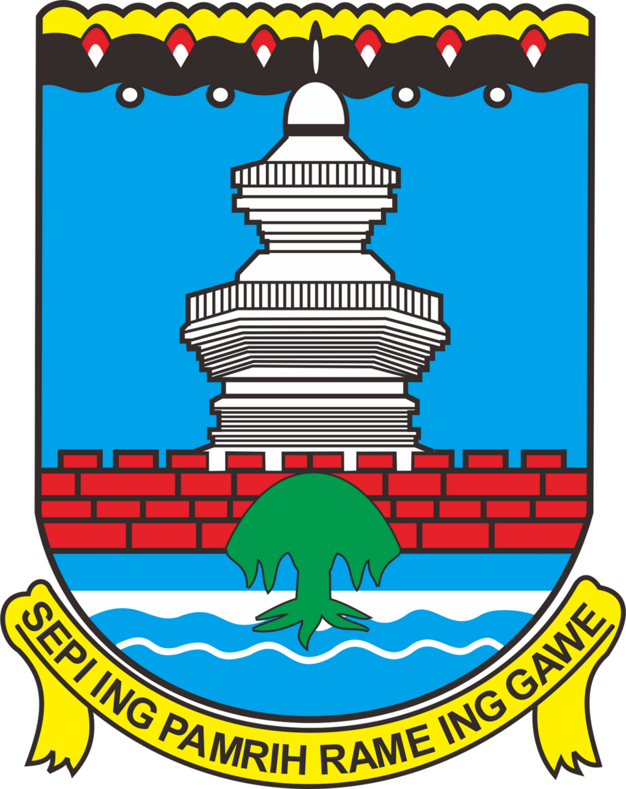

<p align="center">
  
</p>

<h1 align="center">SIMARDAS</h1>
<h3 align="center">Sistem Informasi Manajemen Arsip Daerah Serang</h3>

<p align="center">
  <strong>Sistem Digitalisasi dan Manajemen Arsip Daerah Kabupaten Serang</strong>
</p>

<p align="center">
  <a href="#fitur">Fitur</a> •
  <a href="#teknologi">Teknologi</a> •
  <a href="#instalasi">Instalasi</a> •
  <a href="#penggunaan">Penggunaan</a>
</p>

---

## 📋 Tentang SIMARDAS

**SIMARDAS** (Sistem Informasi Manajemen Arsip Daerah Serang) adalah sistem manajemen arsip digital yang dirancang untuk membantu Pemerintah Kabupaten Serang dalam mengelola, menyimpan, dan mengakses dokumen arsip secara efisien. Dengan antarmuka yang modern dan fitur-fitur canggih, SIMARDAS mewujudkan transformasi digital dalam pengelolaan arsip daerah.

### 🎯 Tujuan

- Mewujudkan tata kelola arsip daerah yang modern dan efisien
- Mempermudah digitalisasi dokumen fisik menjadi format digital
- Menyediakan sistem pencarian arsip yang cepat dan akurat
- Meningkatkan keamanan dan aksesibilitas dokumen arsip

## ✨ Fitur

### 📤 Upload & Digitalisasi Dokumen

- Upload dokumen dalam berbagai format (PDF, gambar, dll)
- Digitalisasi dokumen fisik dengan mudah
- Kategorisasi dan pengorganisasian dokumen terstruktur
- Upload dokumen via scan kamera

### 🔍 Pencarian Arsip Canggih

- Pencarian berdasarkan berbagai kriteria (judul, tanggal, kategori)
- Filter dan sorting yang fleksibel
- Hasil pencarian yang cepat dan akurat

### 📱 Scan Barcode

- Pindai barcode dokumen untuk akses cepat
- Generate barcode otomatis untuk setiap dokumen
- Integrasi dengan sistem labeling dokumen

### 🔐 Keamanan Data

- Sistem autentikasi multi-level
- Role-based access control (Admin, Petugas, User)
- Enkripsi data dan backup otomatis

### 📊 Dashboard & Laporan

- Dashboard statistik real-time
- Laporan aktivitas dan penggunaan sistem
- Log aktivitas untuk audit trail

### 💾 Backup & Restore

- Backup data otomatis dan manual
- Integrasi dengan Google Drive
- Restore data dengan mudah

### 👤 Registrasi Pengguna

- Registrasi mandiri untuk pengguna umum
- Verifikasi email
- Role default sebagai User biasa

## 🛠️ Teknologi

| Kategori       | Teknologi                         |
| -------------- | --------------------------------- |
| Backend        | Laravel 12 (PHP 8.2+)             |
| Frontend       | Bootstrap 5, Blade Templates      |
| Database       | MySQL                             |
| Authentication | Laravel Auth                      |
| File Storage   | Laravel Storage, Google Drive API |
| PDF Generation | DomPDF                            |
| Barcode        | DNS1D Barcode Generator           |

## 📦 Instalasi

### Prasyarat

- PHP >= 8.2
- Composer
- Node.js & NPM
- MySQL
- XAMPP/Laragon (opsional)

### Langkah Instalasi

1. **Clone repository**

    ```bash
    git clone https://github.com/yourusername/simardas.git
    cd simardas
    ```

2. **Install dependencies**

    ```bash
    composer install
    npm install
    ```

3. **Konfigurasi environment**

    ```bash
    cp .env.example .env
    php artisan key:generate
    ```

4. **Setup database**
    - Buat database baru di MySQL
    - Update konfigurasi database di file `.env`

5. **Jalankan migrasi**

    ```bash
    php artisan migrate
    ```

6. **Build assets**

    ```bash
    npm run build
    ```

7. **Jalankan server**

    ```bash
    php artisan serve
    ```

8. Akses aplikasi di `http://localhost:8000`

## 📖 Penggunaan

### Role Pengguna

| Role        | Akses                                                           |
| ----------- | --------------------------------------------------------------- |
| **Admin**   | Full access - kelola user, arsip, backup, dan pengaturan sistem |
| **Petugas** | Upload, edit, dan kelola dokumen arsip                          |
| **User**    | Lihat dan cari dokumen arsip                                    |
| **Umum**    | Akses terbatas setelah registrasi                               |

### Alur Kerja Dasar

1. **Login/Register** ke sistem
2. **Upload** dokumen arsip baru atau scan dokumen fisik
3. **Kategorikan** dokumen sesuai klasifikasi
4. **Cari** dokumen menggunakan fitur pencarian atau scan barcode
5. **Kelola** dokumen (edit, hapus, download)

## 🔒 Keamanan

SIMARDAS mengimplementasikan berbagai lapisan keamanan:

- Password hashing dengan bcrypt
- CSRF protection
- XSS protection
- Role-based access control
- Session management

## 📄 Lisensi

Project ini dilindungi hak cipta. © 2025 Pemerintah Kabupaten Serang.

## 👥 Tim Pengembang

Dikembangkan untuk Pemerintah Kabupaten Serang.

---

<p align="center">
  <strong>SIMARDAS</strong> - Sistem Informasi Manajemen Arsip Daerah Serang
</p>
